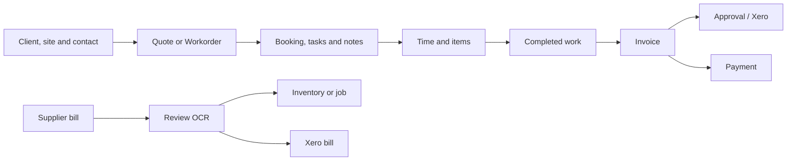

import VerifiedWeb from '/snippets/verified-web.mdx';

<VerifiedWeb />

Seama's operating chain starts with customer and site information, moves through planned and completed work, and finishes with invoicing, payment and accounting verification. Supplier bills form a connected purchasing and stock workflow.

## Job states

- **Quote** — proposed work that can be sent to a client and converted to a Workorder.
- **Workorder** — active work that can be scheduled, assigned, updated and completed.
- **Completed** — work marked complete and ready for the next financial step.
- **Cancelled** — work that will not proceed.

## States that must be checked separately

<Warning>
  Do not infer one state from another. In testing, a fully paid invoice remained in **Pending Approval**, and its Xero status remained **Not synced**. Payment, approval and Xero sync are separate checks.
</Warning>

The same separation applies to bookings and jobs: a staff member shown on a booking did not necessarily appear in the job header's **Assigned To** field.

## Supplier-document workflow

1. Upload or email the supplier document.
2. Wait for processing and parsing.
3. Compare the extracted supplier, number, dates, every line, tax and total with the source image.
4. Choose where line items belong—inventory or a job card—before importing.
5. Save, reload and compare totals again.
6. Mark the document **Ready** only after review.
7. Send to Xero only when supplier and account prerequisites are complete, then verify the result in Xero.

## Next step

Set up the controls that support this workflow in [Set up Seama](/getting-started/setup).
