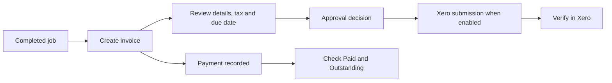

import VerifiedWeb from '/snippets/verified-web.mdx';

<VerifiedWeb />

## Four separate questions

1. **Is the invoice content correct?** Check products, services, composite lines, work-completed text, tax, payment terms, due date and total.
2. **Is it approved?** Review the Seama invoice status or queue.
3. **Did it sync?** Review the Xero status and verify the record in Xero.
4. **Is it paid?** Review **Paid** and **Outstanding** values and the payment history.

<Warning>
  Controlled testing produced a fully paid invoice with **Outstanding $0.00** that still appeared in **Pending Approval** and remained **Not synced**. Reconcile each dimension independently.
</Warning>

## PDF preview

The tested invoice PDF preview reported **Unable to load PDF preview**. If this occurs, do not assume the customer document is correct. Retry after reload, use the approved alternative review path, or escalate with the invoice ID before sending.
